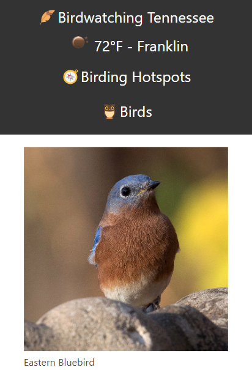

# Birdwatching Tennessee

## Description

- When the page is loaded, then the user's location is requested.
- When the user's location is given, then weather data via location is fetched and current weather data is displayed in the header.
- When the user selects the Hotspots link in the navbar, then they can see suggested areas in which they can birdwatch.
- When the user hovers over the "Birds" dropdown, then they can navigate to that bird on the page.
- When the user clicks on an image of a bird, then they are redirected to that birds corresponding landing page on allaboutbirds.org.
- When the user sees a bird, then they can log their findings.
- When the user's findings are saved, then they are logged in local storage.
- When the user reloads the page, then the saved data is recalled from local storage.
- When the user visits the end of the page, then they are presented with navbar links to additional destinations.

## Link to Site

https://joseph-s-foster.github.io/Birdwatching-Tennessee/

## Screenshot

## Resources

https://www.allaboutbirds.org/news/